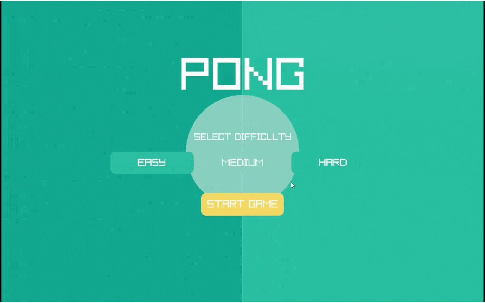

# 🏓 Pong Game

> A classic arcade Pong experience rebuilt in C++ with smooth physics, a reactive CPU opponent, difficulty selection, and progressive speed mechanics.


---

## ✨ Features

- 🎮 **Player vs CPU** — go head-to-head against a reactive CPU opponent
- 🧠 **Difficulty selection** — choose Easy, Medium, or Hard from the startup menu
- 📐 **Angle-based deflection** — where you hit the paddle changes the ball's trajectory
- ⚡ **Progressive speed** — rallies get faster the longer they go, resetting on each score
- 🏆 **Live scoreboard** — scores displayed in real time
- 🎨 **Custom color palette** — clean green-toned visuals with rounded paddles

---

## 📁 Project Structure

| File | Description |
|------|-------------|
| `main.cpp` | Game loop, menu, initialization & collision detection |
| `Ball.cpp / Ball.h` | Ball movement, physics & speed scaling |
| `Paddle.cpp / Paddle.h` | Player and CPU paddle logic |
| `Colors.h` | Custom color palette |

---

## 🛠️ Requirements

- C++17 or later
- [raylib](https://www.raylib.com/) v4.0+
- [CMake](https://cmake.org/download/) 3.15+
- A C++ compiler — `g++` / MinGW-w64 on Windows

---

## ⬇️ Download

Get the project from GitHub:

- 🔗 **Repository:** https://github.com/connerTeev/Pong-Game  
- 📦 **Download ZIP:** https://github.com/connerTeev/Pong-Game/archive/refs/heads/main.zip  

Or clone it:

```bash
git clone https://github.com/connerTeev/Pong-Game.git
```
---

## 🚀 Building

**Windows (MinGW)**

Install raylib and place the files at:
```
C:\raylib\include\raylib.h
C:\raylib\lib\libraylib.a
```
Then build:
```bash
mkdir build
cd build
cmake .. -G "MinGW Makefiles"
cmake --build .
```

**macOS**

```bash
brew install raylib
mkdir build && cd build
cmake ..
cmake --build .
```

**Linux**

```bash
sudo apt install libraylib-dev  # or equivalent for your distro
mkdir build && cd build
cmake ..
cmake --build .
```

Your executable will appear in the `build` folder. For subsequent builds, only `cmake --build .` is needed.

---

## 🕹️ Controls

| Key | Action |
|-----|--------|
| Arrow Up | Move paddle up |
| Arrow Down | Move paddle down |
| ESC | Return to menu |
| Close window | Quit |

---

## 🎯 How to Play

- On startup, select a difficulty and press **Start Game**
- You control the **right paddle** — the CPU controls the left
- Get the ball past your opponent to score a point
- Hit the **edge of your paddle** for sharper, trickier angles
- Survive long rallies — the ball speeds up every 4 hits and resets when someone scores
- Press **ESC** at any time to return to the menu

---

## 🧠 Difficulty Levels

| Difficulty | CPU Speed | CPU Accuracy |
|------------|-----------|--------------|
| Easy | Slow | Aims imprecisely |
| Medium | Moderate | Slight offset tracking |
| Hard | Fast | Near-perfect tracking |

---

## ⚙️ Physics Configuration

Tune the feel of the game directly in `Ball.h`:

| Property | Default | Description |
|----------|---------|-------------|
| `base_speed` | `7.0` | Starting ball speed |
| `max_speed` | `15.0` | Maximum ball speed cap |
| `speed_increment` | `0.5` | Speed added per speed-up event |
| `hits_until_speedup` | `4` | Paddle hits between each speed increase |

---

## 📜 License

Feel free to use, modify, and build on this project. Have fun!
